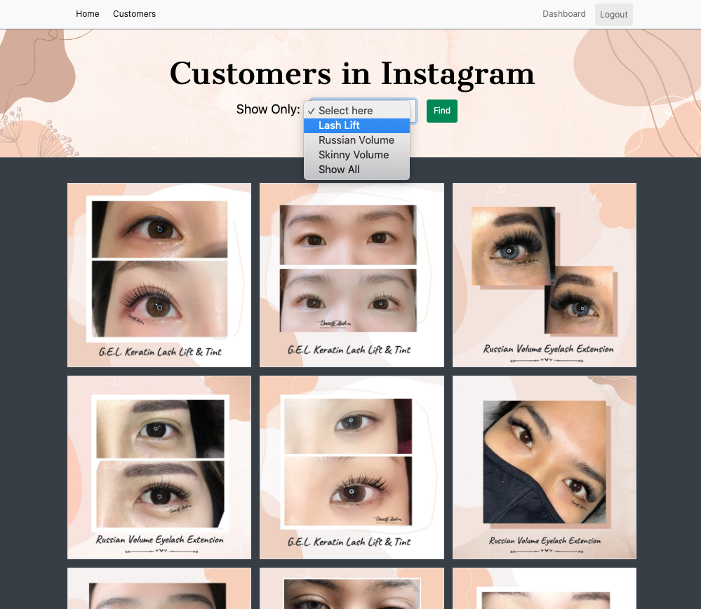
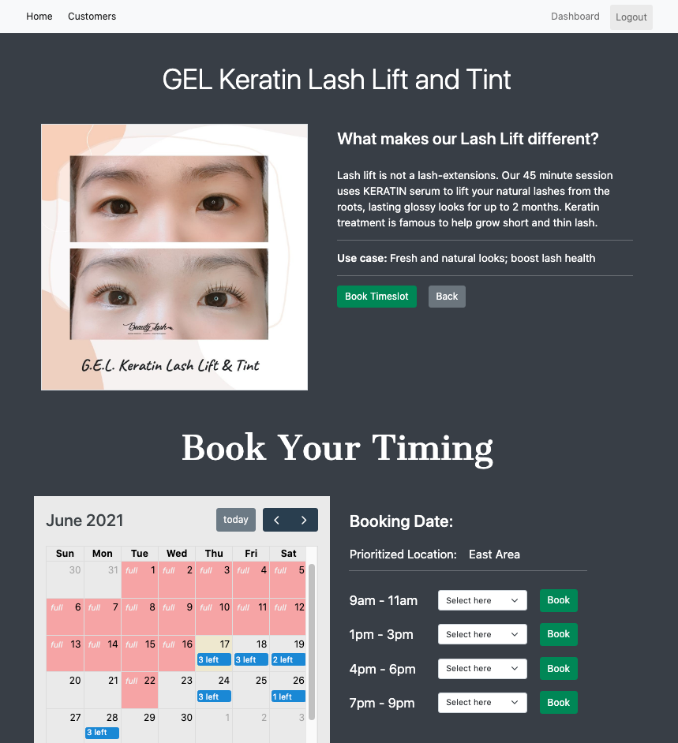
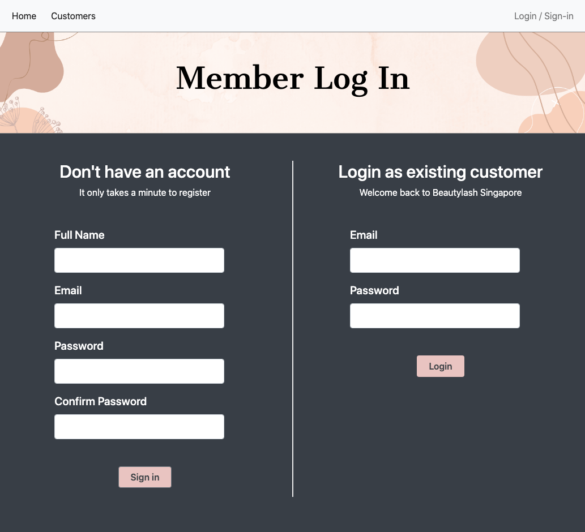
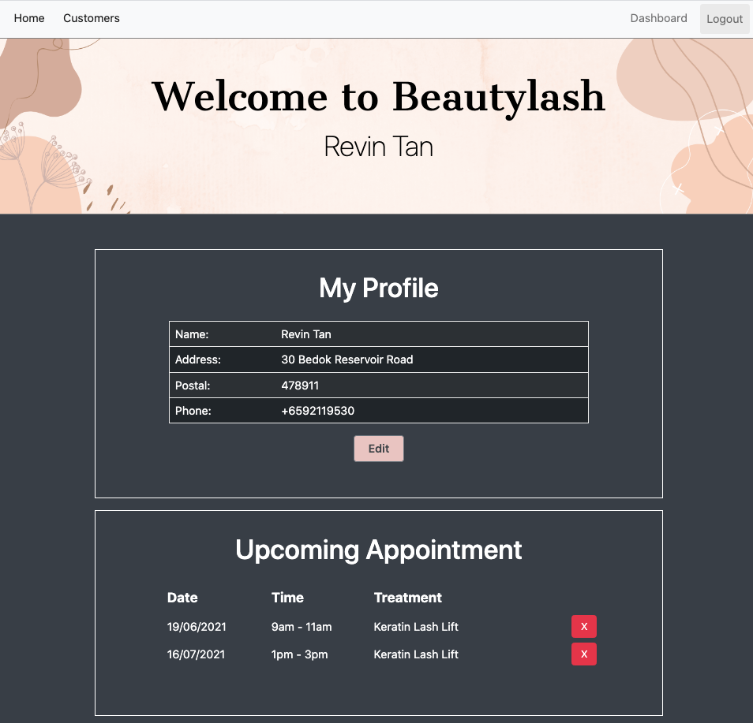
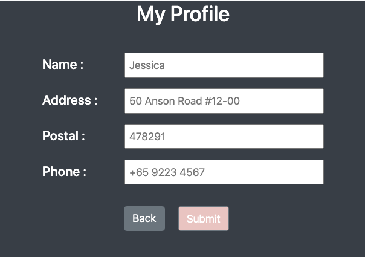

## Project Two: Beautylash Eyelash Extension

Fully developed web for booking services, customer login and upselling features

[Click for Live Demo](https://beautylash.herokuapp.com/beautylash)

## Extension & Library Installed

1. Express EJS
1. Bootstrap - CSS library
1. FullCalendar - calendar library
1. Mongoose - database mgmt
1. Lodash - utility
1. dotenv - privacy
1. Moment.js - time converter
1. Crypto and uuid
1. Flash Message

## Page Views

1. Homepage (index.ejs) - to welcoming users, booking appoinments based on date&time, and look for most recent customers, 

1. Customers in Instagram (customers.ejs) - to showcase our previous customers result with filter function based on types, 

1. Show Images - to provide more details in each treatments and allow them to booking schedule directly, 

1. Register & Login - to help user registration and user login in the same page, 

1. Dashboard - to allow user to have full visibility on their profile, upcoming bookings, and be part of community by adding pictures, 

1. Edit Profile - to edit user address, postal code and contact number 

## Other features that I plan to add in future

1. Stripe - payment gateaway
1. Captcha or antibot

## Challenges I faced while building the app

1. Hard to understand data movement in booking systems

   1. date selection, timeslot selection;
   1. available bookings storage;
   1. calendar render with full/partially timeslot booked;
   1. how to update the whole system in 1 'book' click

1. Combine multiple routes with 'form submit' in 1-page:

   1. Register + login;
   1. Index + carousel + booking calendar;
   1. Edit profile + upcoming appoinment + upload image

1. Improve the carousel experience by sorting most recently uploaded customer to mongoDB,

## Reference used to help solving issues

1. Frequency counter - [Link here](https://levelup.gitconnected.com/how-to-solve-an-anagram-algorithm-using-a-frequency-counter-5bb1f0b817ef)
1. MAP JS - [Link here](https://developer.mozilla.org/en-US/docs/Web/JavaScript/Reference/Global_Objects/Map)
1. Using Fetch in routing (res.send) - [Link here](https://developer.mozilla.org/en-US/docs/Web/API/Fetch_API/Using_Fetch)
