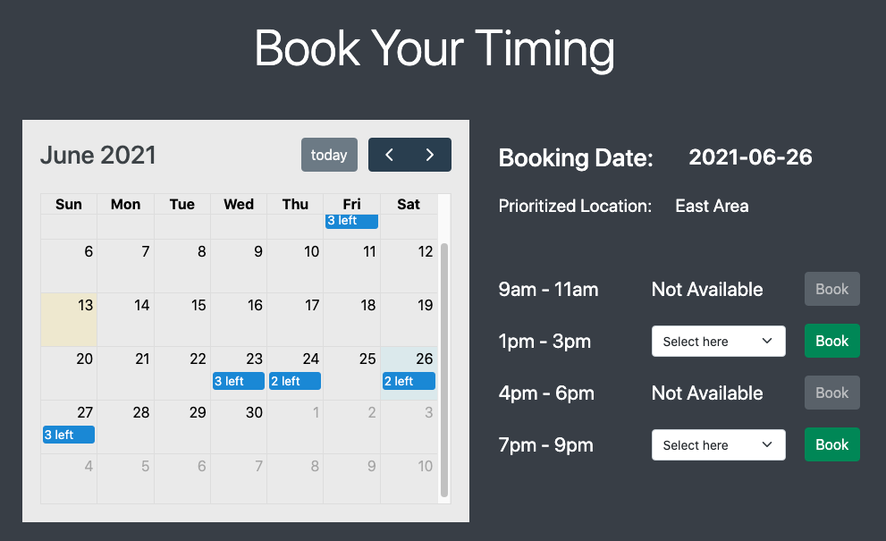

## Project Two: Beautylash Eyelash Extension

Fully developed web for booking services, customer login and upselling features

## Extension & Library Installed

1. Express EJS
1. Bootstrap - CSS library
1. FullCalendar - calendar library
1. Mongoose - database mgmt
1. Lodash - utility
1. dotenv - privacy
1. Moment.js - time converter
1. Crypto and uuid

## Page Views

1. Mainpage (index.ejs) - to welcoming users, booking appoinments based on date&time and look for most popular services,

1. Customer Results (customers.ejs) - to showcase our happy customers with various services implemented,

1. Add New (new.ejs) - to allow customers upload their post-treatment photo to admin for approval to be posted in webpage

1. Register, Login, Dashboard - to help user to have a personal and delightful beautylash membership experience

## Other Library that I plan to use

1. Stripe - payment gateaway
1. Captcha or antibot

## Attempt to built the webpage

1. Create product pages: views, servers and controllers 

1. Create users page : login, register, dashboard 

1. Connecting FullCalendar library to homepage 

1. Currently Work on Booking system tagged between dates, timeslot availability and authenticated-user
